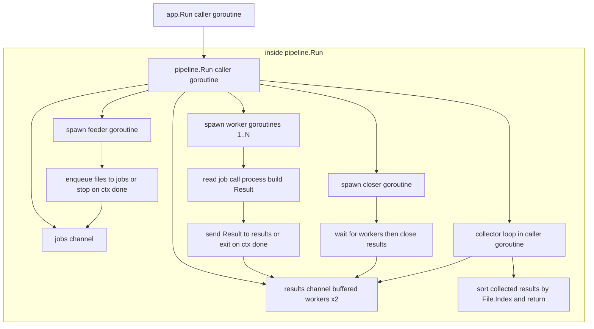

# Architecture

## Runtime Summary

`gpx-merge` processes files in six stages:

1. Parse and validate CLI config (`internal/cli/config.go`)
2. Discover `.gpx` files recursively (`internal/discovery/discovery.go`)
3. Run concurrent per-file processing (`internal/pipeline/run.go` + `internal/processor/process_file.go`)
4. Aggregate successful tracks and statistics (`internal/processor/aggregate.go`)
5. Write merged GPX and human/JSON reports (`internal/gpx/write.go`, `internal/report/report.go`)
6. Optionally append run metrics CSV rows (`internal/report/metrics_csv.go`)

The app entrypoint is `internal/app/app.go`.

## Core Modules

- Parsing: `internal/gpx/parse.go`, `internal/gpx/types.go`
- Optimization: `internal/optimize/simplify.go`, `internal/optimize/round.go`
- Pipeline orchestration: `internal/pipeline/run.go`
- Per-file processing: `internal/processor/process_file.go`, `internal/processor/track_optimize.go`, `internal/processor/track_segments.go`
- Aggregation and totals: `internal/processor/aggregate.go`
- Writer: `internal/gpx/write.go`

## Architectural Pattern

The runtime now follows a **Functional Core, Imperative Shell** split:

- Imperative shell: `internal/app/app.go` performs side effects and orchestration (signals/context wiring, CLI parse, file discovery, filesystem writes, report emission, exit codes).
- Functional core: `internal/processor/*` and `internal/optimize/*` own deterministic data transforms (track optimization, segment ordering checks, warnings, and aggregation from `[]pipeline.Result`).
- Concurrency boundary: `internal/pipeline/run.go` is a reusable worker-pool engine that isolates goroutine/channel lifecycle from domain logic.

## Determinism + Concurrency

Concurrency improves throughput, but output order remains stable:

- Files are assigned deterministic indices during discovery.
- Workers process files in parallel.
- Results are sorted by file index before aggregation/output.

This guarantees reproducible merged ordering regardless of worker scheduling.

## Concurrency Patterns

`gpx-merge` uses a small set of explicit concurrency patterns in `internal/pipeline/run.go`:

- Bounded worker pool: `workers` controls fixed parallelism for per-file processing.
- Producer/consumer pipeline: feeder goroutine sends discovered files over `jobs` while workers consume.
- Fan-out: one input stream (`jobs`) is processed concurrently by `N` worker goroutines.
- Fan-in: workers publish `pipeline.Result` values into a shared `results` channel.
- Channel topology rationale: this runtime uses one shared `results` channel (not per-worker `[]chan Result`); see **Shared Fan-In Channel vs Channel Slice** below for the decision rationale and trade-offs.
- Confinement by ownership: each worker keeps per-file processing state local to its goroutine and communicates only via channels; the collector goroutine exclusively owns and mutates the final `[]Result` buffer before sort.
- Coordinated shutdown: a closer goroutine waits on `sync.WaitGroup` and closes `results` exactly once.
- Cooperative cancellation: feeder and workers stop early when `ctx.Done()` is signaled.
- Deterministic completion barrier: collector buffers all results and sorts by `File.Index` before returning.

### Shared Fan-In Channel vs Channel Slice

#### Summary

`gpx-merge` uses standard fan-out/fan-in with one shared results channel, not a per-worker channel slice. This keeps worker coordination and shutdown simpler while preserving deterministic output order.

#### Context

A question came up while reviewing `internal/pipeline/run.go`:

- Why not use `[]chan Result` for fan-in, as seen in some Go examples?

Current topology in the project:

- One `jobs` channel for fan-out to N workers.
- One shared `results` channel for fan-in from N workers.
- One closer goroutine closes `results` after `wg.Wait()`.
- Collector gathers all results and sorts by `File.Index` before return.

#### Decision

Use one shared fan-in channel for this pipeline.

#### Rationale

- Work is homogeneous across workers; no worker-specific output lanes are required.
- Determinism is guaranteed by post-collection sort (`File.Index`), so per-worker channels are unnecessary for ordering.
- Shutdown ownership is simple: one closer after worker completion, avoiding multi-channel close/merge complexity.
- Operational complexity stays lower than slice-based fan-in designs (for example, multiplex loops or `reflect.Select`).

#### When Channel Slices Make Sense

Use `[]chan` when channels represent distinct lanes and behavior:

1. Sharded or affinity queues where each worker owns state/cache/partition.
2. Priority lanes (`high`, `normal`, `bulk`) with explicit service control.
3. Per-source isolation so one noisy producer cannot starve others.
4. Per-lane ordering guarantees with custom merge semantics.
5. Independent lifecycle control for specific workers/lanes.

#### Trade-Off Rule of Thumb

- If workers are interchangeable and outputs are normalized later, prefer one shared fan-in channel.
- If lanes have distinct policy, ownership, or ordering contracts, channel slices are often justified.

#### Source Pointers

- `internal/pipeline/run.go`
- `docs/ARCHITECTURE.md` (Concurrency Patterns section)

#### Capture Metadata

- Captured from engineering discussion on 2026-02-24.
- Topic type: architecture/concurrency rationale.

## Processing Sequence

```mermaid
sequenceDiagram
    autonumber
    actor CLI
    participant App as app.Run (shell)
    participant Pipe as pipeline.Run
    participant Feed as feeder goroutine
    participant W1 as worker (1..N)
    participant Proc as processor.FileProcessor.Process
    participant Parse as gpx.ParseFile
    participant SegSort as processor.sortTrackSegmentsByFirstTimestamp
    participant Opt as processor.optimizeTrack
    participant Measure as gpx.MeasureTracks
    participant Main as collector
    participant Close as closer goroutine
    participant Agg as processor.AggregateResults
    participant Write as gpx.WriteMerged or gpx.MeasureMerged
    participant Report as report.PrintSummary or report.WriteJSON
    participant Metrics as report.AppendMetricsCSV

    Note over CLI,Pipe: Setup
    CLI->>App: parse config + discover files
    App->>App: build processor.NewFileProcessor(cfg, optOpts)
    App->>Pipe: Run(ctx, files, workers, fileProc.Process)

    Note over Pipe,Close: Pipeline startup
    Pipe->>Feed: start feeder
    Pipe->>W1: start workers
    Pipe->>Close: start closer (wait for workers)

    Note over Feed,Main: Steady-state processing
    loop each input file
        Feed->>W1: jobs <- File
        W1->>Proc: Process(ctx, file)
        Proc->>Parse: parse tracks
        alt --sort-segments-by-time
            Proc->>SegSort: reorder segments by first timestamp
        end
        loop each track
            Proc->>Opt: simplify + distance in/out
        end
        Proc->>Measure: measure optimized bytes
        Proc-->>W1: filePayload | fileError
        W1->>Main: results <- Result
    end

    alt ctx canceled (SIGINT/SIGTERM/timeout)
        Pipe-->>Feed: stop enqueue
        Pipe-->>W1: stop work/send
    end

    Close->>Main: close(results) after wg.Wait()
    Main->>Main: collect + sort by File.Index
    Pipe-->>App: []Result (deterministic order)
    App->>Agg: aggregate per-file stats/warnings/errors
    Agg-->>App: totals + tracks + file stats
    App->>Write: write merged GPX (or measure in dry-run)
    App->>Report: print summary/errors/warnings (+ optional JSON)
    opt --metrics-csv set
        App->>Metrics: append row (started_at_utc, points_in, points_out, workers, duration_ms, mb_in, mb_out)
    end
    App-->>CLI: merged output + report
```

## Goroutine Hierarchy



## Segment Discontinuity Handling

For adjacent segments in the same track, large endpoint gaps can create misleading straight connectors in some viewers.

- Detection: adjacent `<trkseg>` endpoint gaps are checked per source track.
- Warning threshold: a warning is emitted for gaps greater than `1000m`.
- Split behavior: `--split-track-gap` controls when a discontinuity is split into a new track.
  - Default is `1000m`.
  - `0` disables splitting.
- Optional ordering fix: `--sort-segments-by-time` reorders each track's segments by their first parseable timestamp before optimization.
  - If a track has segments without parseable timestamps, that track is left in original order.
- Terminology: `Track Name (part N)` means a new `<trk>` element, not a segment.
- Segment boundaries (`<trkseg>`) are preserved inside each output track part.

## Exit Code Model

- `0`: all files processed successfully
- `1`: one or more files failed
- `2`: configuration/usage/runtime setup error
