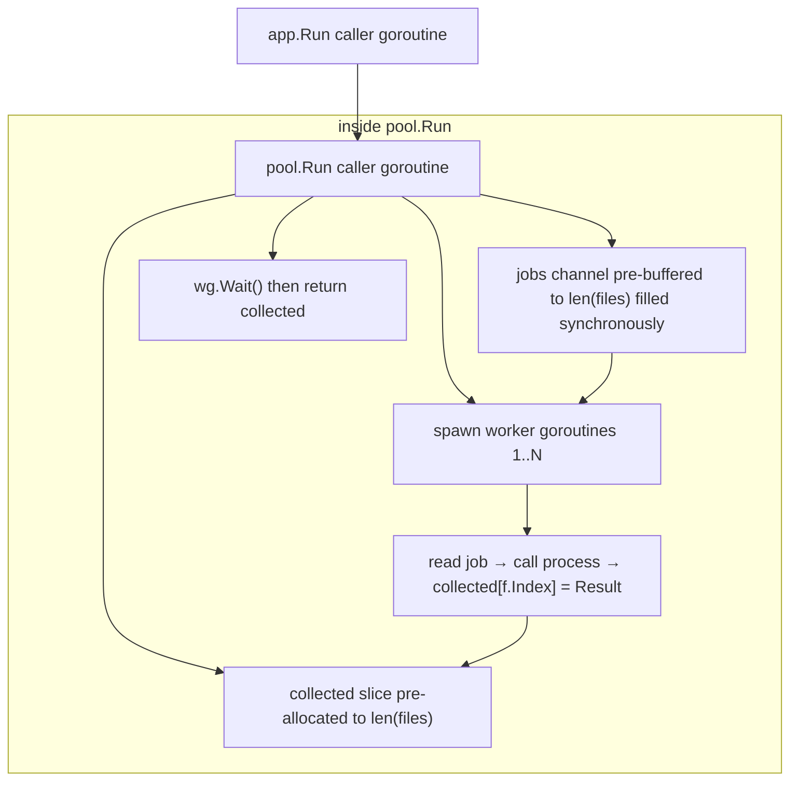

# Architecture

## Runtime Summary

`gpx-merge` processes files in six stages:

1. Parse and validate CLI config (`internal/cli/config.go`)
2. Discover `.gpx` files recursively (`internal/discovery/discovery.go`)
3. Run concurrent per-file processing (`internal/pool/run.go` + `internal/processor/process_file.go`)
4. Aggregate successful tracks and statistics (`internal/processor/aggregate.go`)
5. Write merged GPX and human/JSON reports (`internal/gpx/write.go`, `internal/report/report.go`)
6. Optionally append run metrics CSV rows (`internal/report/metrics_csv.go`)

The app entrypoint is `internal/app/app.go`.

## Core Modules

- Parsing: `internal/gpx/parse.go`, `internal/gpx/types.go`
- Optimization: `internal/optimize/simplify.go`, `internal/optimize/round.go`
- Worker pool: `internal/pool/run.go`
- Per-file processing: `internal/processor/process_file.go`, `internal/processor/track_optimize.go`, `internal/processor/track_segments.go`
- Aggregation and totals: `internal/processor/aggregate.go`
- Writer: `internal/gpx/write.go`

## Architectural Pattern

The runtime now follows a **Functional Core, Imperative Shell** split:

- Imperative shell: `internal/app/app.go` performs side effects and orchestration (signals/context wiring, CLI parse, file discovery, filesystem writes, report emission, exit codes).
- Functional core: `internal/processor/*` and `internal/optimize/*` own deterministic data transforms (track optimization, segment ordering checks, warnings, and aggregation from `[]pool.Result`).
- Concurrency boundary: `internal/pool/run.go` is a reusable worker-pool engine that isolates goroutine/channel lifecycle from domain logic.

## Determinism + Concurrency

Concurrency improves throughput, but output order remains stable:

- Files are assigned deterministic indices during discovery.
- Workers process files in parallel.
- Results are sorted by file index before aggregation/output.

This guarantees reproducible merged ordering regardless of worker scheduling.

## Concurrency Patterns

`gpx-merge` uses a small set of explicit concurrency patterns in `internal/pool/run.go`:

- Bounded worker pool: `workers` controls fixed parallelism for per-file processing.
- Fan-out: one pre-buffered `jobs` channel distributes work across `N` worker goroutines.
- Direct index writes: workers write to `collected[f.Index]` directly; no results channel, no closer goroutine, no sort needed. Safe because each file has a unique index and no two workers process the same file.
- Coordinated shutdown: `wg.Wait()` in the caller blocks until all workers finish, then `collected` is returned.
- Cooperative cancellation: `process` receives `ctx`; cancellation causes it to return quickly, so workers drain remaining jobs fast without blocking.

### Worker Pool vs Pipeline Pattern

`gpx-merge` uses a **worker pool** (fan-out), not a pipeline. The distinction matters when reasoning about concurrency design.

| | Worker Pool | Pipeline |
|---|---|---|
| Stages | 1 | N chained |
| Work units | Independent | Flow through stages |
| Concurrency | N workers do the same thing | N stages overlap in time |
| Result ordering | Preserved by index | Preserved naturally |
| Back-pressure | N/A — pre-buffered jobs | Automatic between stages |

**Worker pool** — all workers apply the same function to independent inputs:
```
jobs ──► worker 1 ──► collected[i]
     ──► worker 2 ──► collected[j]
     ──► worker 3 ──► collected[k]
```

**Pipeline** — distinct stages connected by channels, each running concurrently:
```
parse ──ch1──► optimize ──ch2──► write
```

#### Why worker pool fits here

Each GPX file is processed fully and independently: parse → sort segments → optimize → measure all happen sequentially inside one `processor.FileProcessor.Process` call. The stages are not independent bottlenecks that would benefit from overlapping across files. A pipeline would add channel coordination overhead with no throughput gain.

A pipeline would be worth considering if parsing were significantly slower than optimization and you wanted stage 2 to begin on file N while stage 1 was still working on file N+1.


## Processing Sequence

```mermaid
sequenceDiagram
    autonumber
    actor CLI
    participant App as app.Run (shell)
    participant Pipe as pool.Run
    participant W1 as worker (1..N)
    participant Proc as processor.FileProcessor.Process
    participant Parse as gpx.ParseFile
    participant SegSort as processor.sortTrackSegmentsByFirstTimestamp
    participant Opt as processor.optimizeTrack
    participant Measure as gpx.MeasureTracks
    participant Agg as processor.AggregateResults
    participant Write as gpx.WriteMerged or gpx.MeasureMerged
    participant Report as report.PrintSummary/PrintFailedFiles/PrintWarnings/WriteJSON
    participant Metrics as report.AppendMetricsCSV

    Note over CLI,Pipe: Setup
    CLI->>App: parse config + discover files
    App->>App: build processor.NewFileProcessor(cfg, optOpts)
    App->>Pipe: Run(ctx, files, workers, fileProc.Process)

    Note over Pipe,W1: Worker pool startup
    Pipe->>Pipe: pre-buffer all files into jobs channel (synchronous)
    Pipe->>Pipe: allocate collected []Result of len(files)
    Pipe->>W1: start workers

    Note over W1,Pipe: Steady-state processing
    loop each input file
        W1->>W1: dequeue File from pre-buffered jobs channel
        W1->>Proc: Process(ctx, file)
        Proc->>Parse: parse tracks
        alt --sort-segments-by-time
            Proc->>SegSort: reorder segments by first timestamp
        end
        loop each track
            Proc->>Opt: simplify + distance in/out
        end
        Proc->>Measure: measure optimized bytes
        Proc-->>W1: filePayload | fileError
        W1->>W1: collected[file.Index] = Result
    end

    alt ctx canceled (SIGINT/SIGTERM/timeout)
        Pipe-->>W1: process(ctx) returns early; worker continues draining jobs
    end

    Pipe->>Pipe: wg.Wait()
    Pipe-->>App: []Result (deterministic order by index)
    App->>Agg: aggregate per-file stats/warnings/errors
    Agg-->>App: totals + tracks + file stats
    App->>Write: write merged GPX (or measure in dry-run)
    App->>Report: print summary/errors/warnings (+ optional JSON)
    opt --metrics-csv set
        App->>Metrics: append row (started_at_utc, points_in, points_out, workers, duration_ms, mb_in, mb_out)
    end
    App-->>CLI: merged output + report
```

## Goroutine Hierarchy



## Input Validation

Coordinate bounds are validated during parsing in `internal/gpx/parse.go`, immediately before a point is appended to the segment buffer:

- Latitude must be in `[-90, 90]`; values outside this range return an error of the form `invalid latitude <value>: must be in [-90, 90]`.
- Longitude must be in `[-180, 180]`; values outside this range return an error of the form `invalid longitude <value>: must be in [-180, 180]`.

Boundary values (`±90` lat, `±180` lon) are valid. An out-of-bounds point causes `ParseFile` to return immediately, which surfaces as a per-file error through the worker pool and is counted in the exit-code model below.

## Segment Discontinuity Handling

For adjacent segments in the same track, large endpoint gaps can create misleading straight connectors in some viewers.

- Detection: adjacent `<trkseg>` endpoint gaps are checked per source track.
- Warning threshold: a warning is emitted for gaps greater than `1000m`.
- Split behavior: `--split-track-gap` controls when a discontinuity is split into a new track.
  - Default is `1000m`.
  - `0` disables splitting.
- Optional ordering fix: `--sort-segments-by-time` reorders each track's segments by their first parseable timestamp before optimization.
  - If a track has segments without parseable timestamps, that track is left in original order.
- Terminology: `Track Name (part N)` means a new `<trk>` element, not a segment.
- Segment boundaries (`<trkseg>`) are preserved inside each output track part.

## Exit Code Model

- `0`: all files processed successfully
- `1`: one or more files failed
- `2`: configuration/usage/runtime setup error
